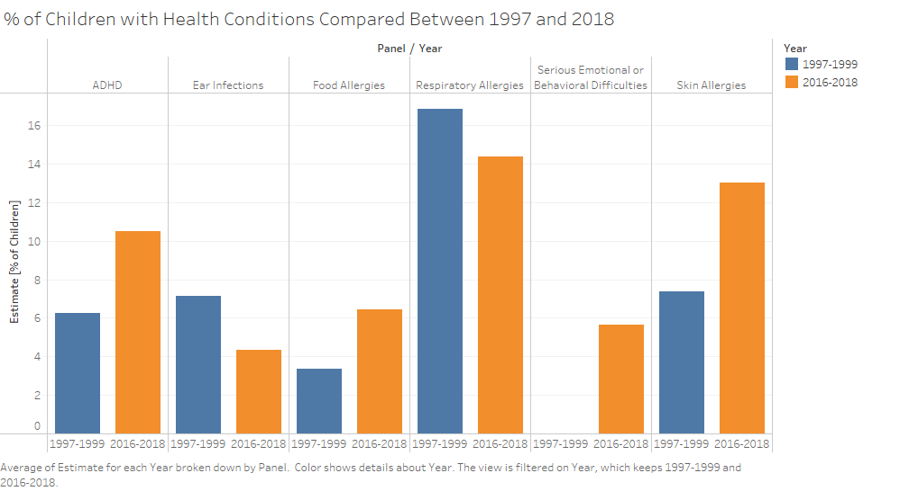

# MIST4610GroupProject2

## Team Name and Members
**group8**
- Forcucci, Enzo:
- Runckel, David
- Trotman, William:
  
## Dataset Description
Our group chose to visualize the dataset "Health conditions among children under age 18, by selected characteristics: United States" provided by the U.S. Department of Health & Human Services.

https://catalog.data.gov/dataset/health-conditions-among-children-under-age-18-by-selected-characteristics-united-states-53b56

The dataset recorded the percentage of children with health conditions in the United States between 1997-2018. Some of the health conditions include ADHD, asthma, food allergies, and skin allergies. 2744 rows of data were contained within the dataset with 16 columns/fields providing descriptive information regarding each row. Some key columns/fields our group chose to utilize in our visualizations are listed below.

**Panel Column:** The different health conditions such as ADHD, asthma, food allergies, and skin allergies.

**Stub Label Column:** The various characteristics of the children such as age, gender, and race.

**Year Column:** Each year between 1997-2018 is grouped by a lapse of 3 years. For example, 1997-1999 or 2013-2015.

**Estimate Column:** The percentage of children afflicted by the health condition(s).

## Questions
**1.** Does the percentage of children affected by skin allergies differ between races?

**2.** Does the percentage of children affected by various health conditions vary between 1997-1999 and 2016-2018?

## Dataset Manipulations

## Analysis and Results

## Tableau Packaged Workbook
**Tableau:** https://github.com/DavidRunckel/MIST4610GroupProject2/blob/main/MIST4610GroupProject2.twbx

**Presentation:** https://docs.google.com/presentation/d/1_spfeNQEnBOtTZ1GlbQeA-eewAAE1KfyYS9dKZrO6pU/edit?usp=sharing
